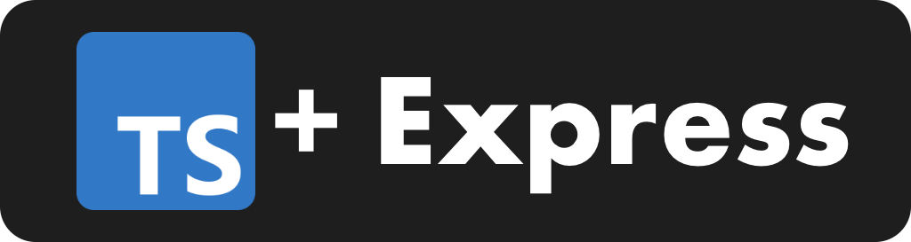

<p align="center">
  <a href="https://expressjs.com/" target="blank"></a>
</p>

<h1 align="center">🚀 Express + Typescript Template 🚀</h1>

<p align="center">
  Template for new API REST based on Express and Typescript with Clean Code and Hexagonal Architecture
</p>

<p align="center">
  <a href="https://github.com/AlbertHernandez/express-typescript-service-template/actions/workflows/node.yml?branch=main"></a>
  <a href="https://nodejs.org/docs/latest-v20.x/api/index.html"></a>
  <a href="https://www.typescriptlang.org/"></a>
  <a href="https://www.npmjs.com/"></a>
  <a href="https://www.typescriptlang.org/"></a>
  <a href="https://jestjs.io/"></a>
  <a href="https://www.docker.com/"></a>
</p>

## Motivation 👀

Recently I have been very involved in the development of backend applications with javascript technologies, for this I configure per project a series of tools to have the best possible practices such as dependency injection, testing, strong typing, hexagonal architecture, docker images, pre push and commits. 

This tools for its installation per project is a tedious and laborious task so I have chosen to make a template that we can use at the beginning of the application.

Inspired by projects of very important and knowledgeable people in the field such as:

- [Fernando Herrera](https://github.com/Klerith)

- [Albert Hernandez](https://github.com/AlbertHernandez)

## 🧑‍💻 Developing

First we need to download the repository

```bash
git clone https://github.com/DonatoCalvillo/api-typescript-express-template.git
```

And install all dependencies

```bash
cd api-typescript-express-template && npm install
```

We need to set the environments variables

```bash
cp .env.example .env
```

To run the project we have options

### 🔥 Hot reload (development)

We can run the project in development with hot reload and exposing a **debug port**, the `9229`, but first we need to configure the IDE

Now, you should be able to start debugging configuring using your IDE. For example, if you are using vscode, you can create a `.vscode/launch.json` file with the following config:

```json
{
  "version": "0.1.0",
  "configurations": [
    {
      "type": "node",
      "request": "attach",
      "name": "Attach to Rest Api",
      "restart": true,
      "port": 9229
    }
  ]
}
```

Once you configure the IDE we can run 
```bash
npm run start:dev
```

### 🐳 Docker

The project is dockerized so we need to run

- Development

```bash
docker-compose up -d rest-api-dev
```

- Production

```bash
docker-compose up -d rest-api-prd
```

If you want to stop the container, you can stop the service running:

```bash
docker-compose down
```

## ⚙️ Building

To build the api we can run 
```bash
npm run build
```

## 📋 Testing

The tests are written in Mocha and the assertions done using Jest

```
"jest": "^29.7.0"
```

We can run the test with the command

```
npm run test
```

Test files are created under test folder.

## 🔦 Linting

To run the linter you can execute:

```bash
npm run lint
```

And for trying to fix lint issues automatically, you can run:

```bash
npm run lint:fix
```
